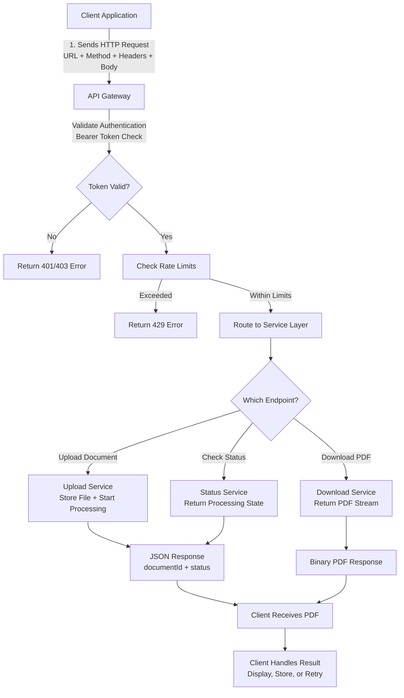

# 📘 DocuMagic PDF API — Documentation Project

Welcome to the DocuMagic PDF API documentation project. This repository showcases a complete, end‑to‑end example of developer‑focused technical writing, including:

- A **User Guide**
- A **Reference Guide**
- A **How to Read API Documentation Primer**
- A **Request Flow Diagram**
- A clean, structured **README** (this file)

The goal of this project is to demonstrate clear, consistent, and developer‑friendly documentation for a fictional PDF‑conversion API.

---

## 📂 Repository Structure

```
/
├── README.md
├── docs/
│   ├── user-guide.md
│   ├── api-reference.md
│   ├── how-to-read-api-docs.md
│   └── diagrams/
│       └── api-flow.md
```

You can adjust the folder names as needed — this is a clean, industry‑standard layout.

---

## 🚀 Quickstart

This section gives developers a fast path to making their first successful API call.

### 1. Get Your API Key
Create an account in the DocuMagic Developer Portal and generate an API key.

### 2. Upload a Document
```bash
curl -X POST "https://api.documagic.com/v1/documents/upload" \
  -H "Authorization: Bearer <YOUR_API_KEY>" \
  -F "file=@invoice.docx"
```

### 3. Check Status
```bash
curl -X GET "https://api.documagic.com/v1/documents/<documentId>" \
  -H "Authorization: Bearer <YOUR_API_KEY>"
```

### 4. Download the PDF
```bash
curl -L -o output.pdf \
  "https://api.documagic.com/v1/documents/<documentId>/download" \
  -H "Authorization: Bearer <YOUR_API_KEY>"
```

---

## 🔐 Authentication Overview

All requests require a Bearer token:

```
Authorization: Bearer <YOUR_API_KEY>
```

API keys should be stored securely and rotated regularly.

For full details, see:  
**`docs/api-reference.md` → Authentication**

---

## 🧭 API Request Flow Diagram

Paste this directly into GitHub to render the diagram:



---

## 📚 Documentation

### **User Guide**
A step‑by‑step walkthrough of authentication, uploading documents, checking status, downloading PDFs, and handling errors.  
➡️ `docs/user-guide.md`

### **API Reference Guide**
Complete endpoint documentation, including parameters, data types, examples, error codes, rate limits, and versioning.  
➡️ `docs/api-reference.md`

### **How to Read API Documentation Primer**
A beginner‑friendly guide explaining how to interpret authentication, endpoints, parameters, examples, and more.  
➡️ `docs/how-to-read-api-docs.md`

### **API Request Flow Diagram**
Diagram‑ready text showing how requests move through the system.  
➡️ `docs/diagrams/api-flow.md`

---

## 🎯 Project Purpose

This project demonstrates:

- Clear, structured, developer‑focused documentation
- Consistent patterns across endpoints
- Layered information design (concept → task → reference)
- Realistic examples and error handling
- A complete documentation set suitable for engineering teams

It serves as a portfolio sample for technical writing roles involving APIs, engineering documentation, or developer experience.

---

## 🧩 Technologies & Formats Used

- Markdown (GitHub‑native)
- Mermaid diagrams
- REST API conventions
- JSON examples
- cURL examples
- DITA‑style modular structure

---

## 🙌 About the Author

This project was created by **Marc Zimmerman** as part of a technical writing portfolio demonstrating clarity, structure, and developer‑focused documentation.
